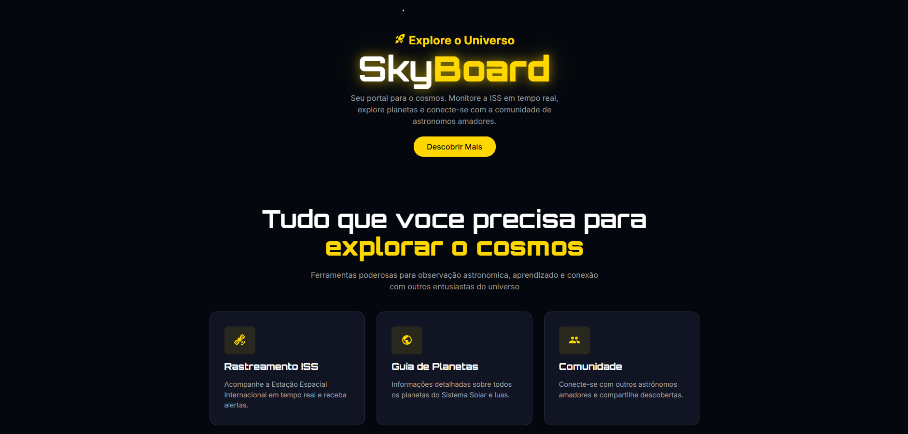

# 🚀 SkyBoard - Web Landing Page


> **Seu portal para o cosmos.** Landing Page oficial do aplicativo SkyBoard, desenvolvida para apresentar as funcionalidades de monitoramento espacial e conectar a comunidade de astrônomos.

[](https://reactjs.org/)
[](https://vitejs.dev/)
[](https://mui.com/)
[](https://developer.mozilla.org/en-US/docs/Web/CSS)

---

## 🌌 Sobre o Projeto

Este projeto é uma  **Landing Page** responsiva do aplicativo móvel que estou planejando o desevolvimento, o **SkyBoard**. O objetivo desta página é servir tanto como prova de habilidade, como vitrine para o futuro aplicativo, convertendo visitantes em usuários através de links de download (App Store e Google Play).

O design foi focado em uma experiência imersiva ("Space Vibe"), utilizando fundo escuro, efeitos de neon e glassmorphism (vidro fosco).

### ✨ Destaques Visuais
- **Fundo Estrelado Animado:** Criado com CSS puro (sem imagens pesadas) para performance.
- **Glassmorphism:** Cards com transparência e desfoque para modernidade.
- **Responsividade:** Layout adaptável para Celular, Tablet e Desktop.
- **Scroll Suave:** Navegação fluida entre as seções.

---

## 📱 O Aplicativo Mobile

Em breve!

---

## 🎨 Screenshots



---

## 🛠️ Tecnologias Utilizadas

- **React.js**: Biblioteca principal para construção da interface.
- **Vite**: Build tool para desenvolvimento rápido.
- **Material UI (MUI)**: Componentes de interface (Links, ícones, tipografia).
- **CSS3 / CSS Modules**: Estilização avançada, animações de estrelas e brilho neon.

---

## 🚀 Como rodar o projeto

Pré-requisitos: Você precisa ter o [Node.js](https://nodejs.org/) instalado.

```bash
# 1. Clone o repositório
git clone [https://github.com/JuniorGCY/SkyBoard-Web.git](https://github.com/JuniorGCY/SkyBoard-Web.git)

# 2. Entre na pasta do projeto
cd skyboard-web

# 3. Instale as dependências
npm install

# 4. Rode o servidor de desenvolvimento
npm run dev